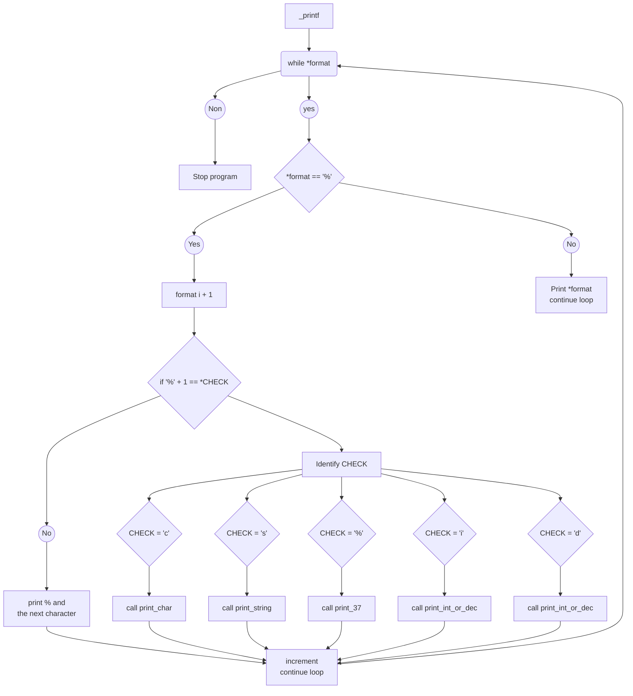

# \_printf project - Holberton School C#25 :horse_racing:

## Quick description :pushpin:

The repository contains **my_print.c** and **all the files** used to compile our own `printf()`
\_printf() is a function that formats and prints data. This has the direction of use of the `printf()` of `<stdio.h>.


## Compilation command :pencil:

Our program will be compiled enabling most of the commons and optional warning options and treating them all as errors, by following strict C language rules and using the older C89 santard with some extra features specific to GCC and ignoring warnings about mismatched printf style format strings

This will be compiled this way :
``gcc -Wall -Werror -Wextra -pedantic -std=gnu89 -Wno-format *.c``


## Requirements :wine_glass:

Our project has been coded on Ubuntu 22.04 and gcc is version 13.2.0

## Betty Style :no_entry_sign:

All the files are written with the [Betty coding style](https://www.holbertonschool.fr/post/quest-ce-que-la-regle-betty-dans-le-langage-de-programmation-c)

## Macro and functions allowed :white_check_mark:
`write`
`malloc`, `free`
`va_start`, `va_end`, `va_copy`, `va_arg`

## Repository files list :chart:

| File name          | % | Description                                                                  |
| -----------------: | :--: | ---------------------------------------------------------------------------- |
| _printf.c          |      | Contains the main function `_printf()`                                       |
| get_function.c     |      | `get_function()` checks \*format and calls the function needed |
| print_char.c       | %c |  Contains `print_char()` that prints a character                   |
| print_string.c     | %s | Contains `print_string()`that prints a string                     |
| print_37.c         | %% | Contains `print_37()`that printf '%'                              |
| print_int_or_dec.c | %d | Contains `print_int_or_dec()` that prints decimals | 
|                    | %i | Contains `print_int_or_dec()` that prints decimals |
| main.h             |      | Contains all the headers, prototypes and structure needed                    |
| man_3_printf       |      | This is the man page of our _printf                                          |
| _putchar.c         |      | Contains our own puchar command permitting to print a character              |

## Flowchart :symbols:
We've started the project to re-write the `_printf` by writting a flowchart to organise our code.
Here a link to our first flowchat on draw.io: [My Printf Flowchart](https://i.ibb.co/b795Py1/Copie-de-my-printf-flowchart-drawio.png)



## Examples :interrobang:

```
#include <stdio.h> 
#include <string.h> 
#include "main.h"

int main(void) 
{
_printf("hello everynyan\n");
_printf("i have %d apples\n",5); 
_printf("my name is %s\n", "lancelot"); 
_printf("have %i at a test is the same to say i have %c\n", 80, 'B'); 
_printf("let's go for 100 %%\n"); return(0); 
}
```
**STDOUT**:
```
hello everynyan
i have 5 apples
my name is lancelot
have 80 at a test is the same to say i have B
let's go for 100 %
```

## Authors :underage:
- Cyprien Gehu
- Théo Lesmayoux
- Adrien Vieilledent

